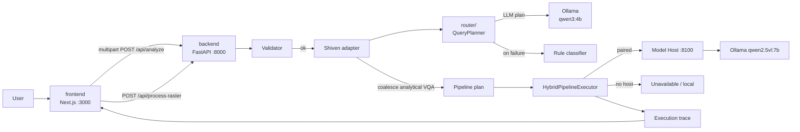
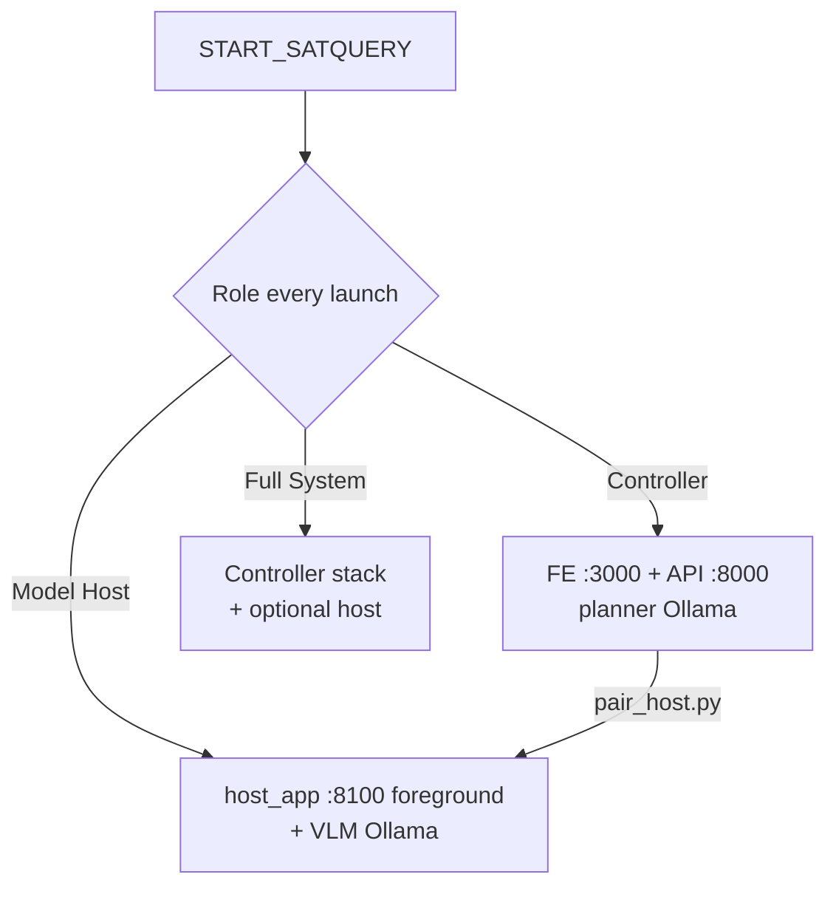
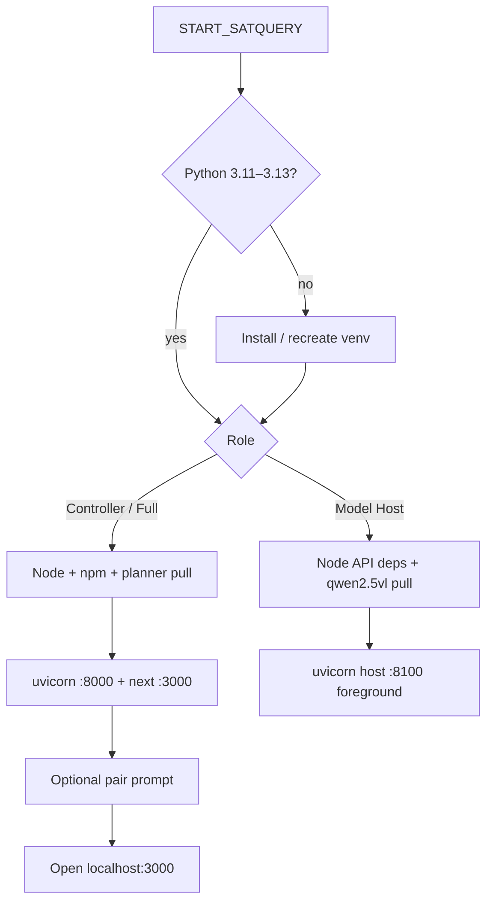
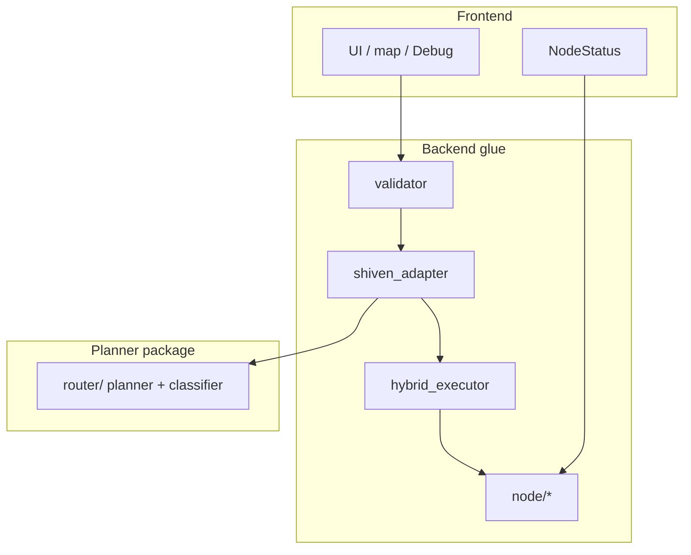
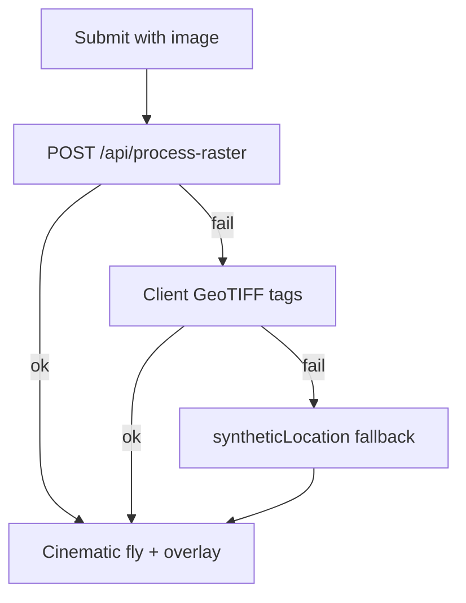

# Architecture

How SatQuery is wired today: launcher roles, analyze path (validator → router → hybrid / remote VLM), and where code lives.

---

## 1. Big picture



**Design rules:** Frontend UX stays intact. Backend is the integration boundary. Multi-device is a **node + hybrid executor** layer — not a second app. Router prompts/classifier may be tightened so one analytical question does not fan out into captioning + grounding.

---

## 2. Device roles (same repo)



| Role | Processes | Does not |
|------|-----------|----------|
| Controller | Next + `app.main:app` + planner model | Pull large VL by default |
| Model Host | `app.node.host_app:app` on **8100** (live console) | Frontend |
| Full System | Controller path (+ host pieces as configured) | Assume every GPU fits every model |

State file (gitignored): `.satquery/device.json` — pairing tokens, hosted model tags. Cleared on each clean shutdown; **re-pair after restart**.

---

## 3. What the one-click launcher does



| Step | Windows | macOS |
|------|---------|-------|
| Entry | `START_SATQUERY.bat` | `START_SATQUERY.command` |
| Script | `scripts/start-satquery.ps1` | `scripts/start-satquery.sh` |
| Logs | `scripts/logs/` (+ live host console) | same |

| Variable | Default | Meaning |
|----------|---------|---------|
| `USE_SHIVEN_ROUTER` | `true` | Use `router/` planner via adapter |
| `SKIP_MODEL_INFERENCE` | `true` | Do not load specialist weights locally |
| `SHIVEN_ROUTER_ROOT` | `<repo>/router` | Planner package path |
| `OLLAMA_BASE_URL` | `http://127.0.0.1:11434` | Local Ollama |
| `OLLAMA_PLANNER_MODEL` | `qwen3:4b-instruct` | Text planner |
| `NEXT_PUBLIC_API_URL` | `http://127.0.0.1:8000` | Frontend → backend |

---

## 4. Request path (analyze)

```mermaid
sequenceDiagram
  participant UI as Frontend
  participant API as FastAPI
  participant VAL as Validator
  participant AD as ShivenAdapter
  participant QP as QueryPlanner
  participant HY as HybridExecutor
  participant MH as ModelHost
  participant TB as TraceBuilder

  UI->>API: POST /api/analyze
  API->>VAL: validate images + query
  VAL-->>API: VALID / WARNING or stop (422)
  API->>AD: route(query, images)
  AD->>QP: LLM / rule plan
  QP-->>AD: QueryPlan tasks[]
  AD->>AD: coalesce analytical VQA; drop spurious GROUNDING/CAPTION
  AD-->>API: RoutingDecision + intent_decomposition
  API->>HY: execute(pipeline)
  alt paired Model Host
    HY->>MH: POST /node/inference (base64 images)
    MH->>MH: GeoTIFF→PNG if needed
    MH-->>HY: answer REMOTE
  else no host / specialist stub
    HY-->>API: model not loaded / unavailable
  end
  API->>TB: execution_trace
  API-->>UI: answer + trace (+ NodeStatus poll)
```

### Adapter mapping (router task → backend models)

| Router task | Models selected | Typical actions |
|-------------|-----------------|-----------------|
| `GROUNDING` | `grounding_dino`, `sam` | detect → segment |
| `CAPTIONING` | `rs_vlm` | generate_caption |
| `VQA` | `rs_vlm` | answer_question |
| `CHANGE_DETECTION` | `change_detection`, `rs_vlm` | change map → describe |
| `CHANGE_VQA` | `change_detection`, `change_vqa` | change map → answer |
| `OPTICAL_SAR` | `optical_sar_fusion`, `rs_vlm` | fuse → analyze |

**Routing note:** Multi-part analytical questions (“what features… where relative to center… what evidence…”) are kept as **one VQA**. Explicit dual actions (“Find the river and describe the image”) still split GROUNDING + CAPTIONING.

Remote VQA/caption steps use logical model id `qwen-vl` → host Ollama tag `qwen2.5vl:7b`.

---

## 5. Module map

```text
frontend/src/
  app/page.tsx              sessions, map, turns
  hooks/useAnalysis.ts      POST /api/analyze
  components/NodeStatus.tsx Model Host / VLM strip
  components/DebugPanel.tsx router + REMOTE block
  types/api.ts              response + telemetry

backend/app/
  api/routes.py             analyze / health
  api/node_controller.py    /api/nodes/* pairing + status
  agent/validator.py        pre-router hard validation
  agent/query_requirements.py / geo_checks.py
  agent/shiven_adapter.py   plan map + coalesce
  agent/hybrid_executor.py  remote rs_vlm then fallback
  agent/unavailable_executor.py
  agent/router.py           RuleBasedRouter (+ RoutingDecision)
  node/                     Model Host package (host_app, client, registry, ollama_runtime, …)
  output/trace.py           Debug execution_trace
  utils/config.py           ports, Ollama, role env

router/app/
  planner/                  LLM prompt + QueryPlanner
  router/classifier.py      rule fallback / compound VQA
  agents/ / pipelines/      specialist stubs
```



---

## 6. Debug Mode & connection strip

| UI signal | Meaning |
|-----------|---------|
| Answer from remote VLM | Paired host ran `/node/inference` (`Execution: REMOTE`) |
| Answer `Model not available` / pairing hint | No host or specialists skipped |
| Badge `fallback rule` | Ollama planner failed; rule-based plan used |
| `model not loaded` | Specialist selected but weights not loaded |
| Intent cards | Decomposition after adapter coalesce |
| Sidebar Model Host / VLM | Live poll of `/api/nodes/status` |

---

## 7. Raster / map path (unchanged UX)



Synthetic location is for demo camera polish only — not fake model output.

---

## 8. Ports and processes

| Service | Port | Process |
|---------|------|---------|
| Frontend | 3000 | `next dev` (Controller / Full System) |
| Backend | 8000 | `uvicorn app.main:app` |
| Model Host | 8100 | `uvicorn app.node.host_app:app` |
| Ollama | 11434 | `ollama serve` |

Only **one** app should bind each port. Do not also start `router/` as a separate uvicorn for the integrated demo — the adapter imports the planner in-process.
