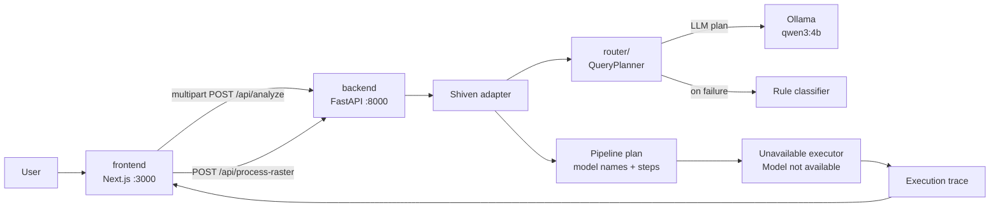
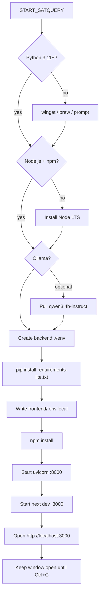
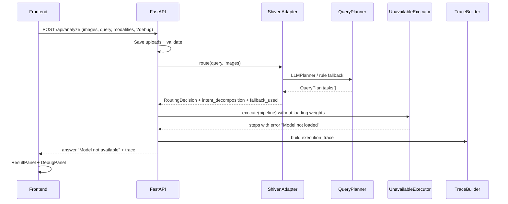
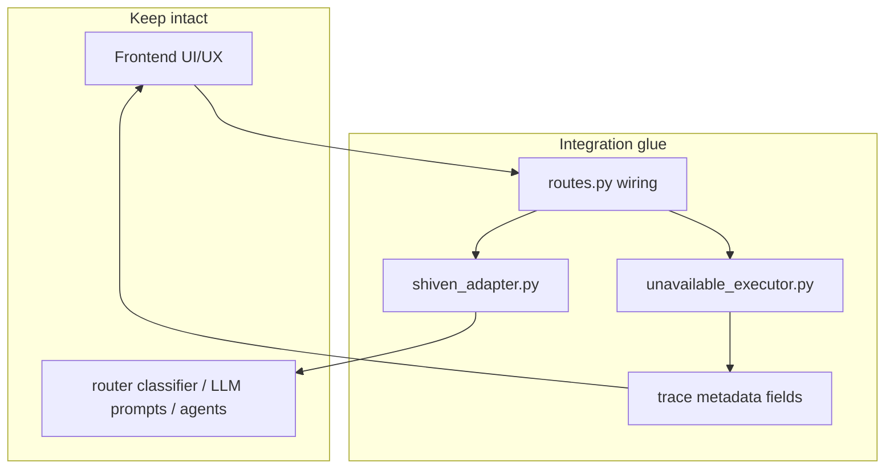
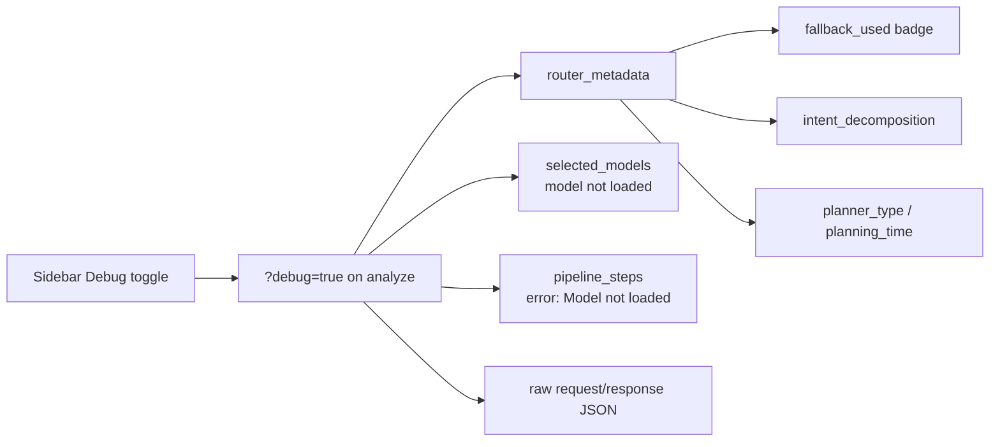
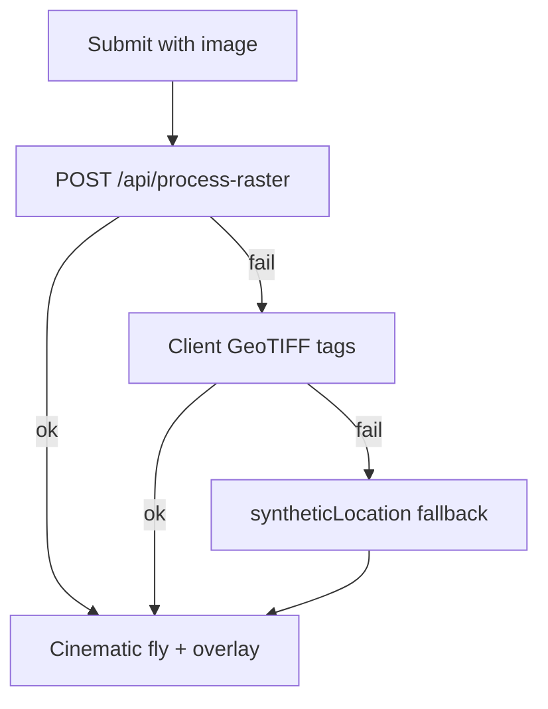

# Architecture

How SatQuery is wired today: what runs when you click the launcher, how a query flows through the system, and where each piece of code lives.

---

## 1. Big picture



**Design rule:** Frontend and router cores stay intact. The backend is the integration boundary. A thin adapter calls the router planner and maps its plan into the API contract the UI already expects.

---

## 2. What the one-click launcher does



| Step | Windows | macOS |
|------|---------|-------|
| Entry | `START_SATQUERY.bat` | `START_SATQUERY.command` |
| Script | `scripts/start-satquery.ps1` | `scripts/start-satquery.sh` |
| Package manager assist | `winget` when available | `brew` when available |
| Logs | `scripts/logs/` | `scripts/logs/` |

Environment the launcher sets for the backend process:

| Variable | Default | Meaning |
|----------|---------|---------|
| `USE_SHIVEN_ROUTER` | `true` | Use `router/` planner via adapter |
| `SKIP_MODEL_INFERENCE` | `true` | Do not load specialist weights; emit honest “not loaded” steps |
| `SHIVEN_ROUTER_ROOT` | `<repo>/router` | Path to planner package |
| `OLLAMA_BASE_URL` | `http://127.0.0.1:11434` | Local LLM API |
| `OLLAMA_PLANNER_MODEL` | `qwen3:4b-instruct` | Small text planner model |
| `NEXT_PUBLIC_API_URL` | `http://127.0.0.1:8000` | Frontend → backend |

---

## 3. Request path (analyze)



### Adapter mapping (router task → backend models)

| Router task | Models selected | Typical actions |
|-------------|-----------------|-----------------|
| `GROUNDING` | `grounding_dino`, `sam` | detect → segment |
| `CAPTIONING` | `rs_vlm` | generate_caption |
| `VQA` | `rs_vlm` | answer_question |
| `CHANGE_DETECTION` | `change_detection`, `rs_vlm` | change map → describe |
| `CHANGE_VQA` | `change_detection`, `change_vqa` | change map → answer |
| `OPTICAL_SAR` | `optical_sar_fusion`, `rs_vlm` | fuse → analyze |

Multi-task plans (e.g. “locate … then describe …”) become a **flat ordered pipeline**. Debug Mode shows the original decomposition under **Intent decomposition**.

---

## 4. Module map

```text
frontend/src/
  app/page.tsx              orchestrates sessions, map, turns
  hooks/useAnalysis.ts      POST /api/analyze
  hooks/useRasterOverlay.ts POST /api/process-raster
  components/DebugPanel.tsx router + models + waterfall
  types/api.ts              mirrors backend response schema

backend/app/
  api/routes.py             analyze / health
  agent/shiven_adapter.py   thin import + plan mapping (does not edit router core)
  agent/unavailable_executor.py  honest no-weights path
  agent/router.py           RoutingDecision schema (+ optional planner fields)
  output/trace.py           Debug execution_trace
  utils/config.py           ports, Ollama, SHIVEN_ROUTER_ROOT

router/app/
  planner/                  LLM + rule fallback QueryPlanner
  router/                   capability router + classifier
  agents/ / pipelines/      specialist stubs (unused when SKIP_MODEL_INFERENCE)
```



---

## 5. Debug Mode (what you should see)



| UI signal | Meaning |
|-----------|---------|
| Answer `Model not available` | Specialist weights not run (`SKIP_MODEL_INFERENCE=true`) |
| Badge `fallback rule` | Ollama/LLM plan failed; rule-based plan used |
| `model not loaded` | Model name was selected but weights were not loaded |
| Intent cards | How the query was split and which models each subtask would call |

When real models are wired later: set `SKIP_MODEL_INFERENCE=false` and replace stub loaders — the same Debug contract can carry real payloads/telemetry.

---

## 6. Raster / map path (unchanged UX)



Synthetic location is **kept on purpose** for demo polish (camera always has somewhere to go). It is not used as fake NLP/model output.

---

## 7. Ports and processes

| Service | Port | Process |
|---------|------|---------|
| Frontend | 3000 | `next dev` |
| Backend | 8000 | `uvicorn app.main:app` |
| Ollama | 11434 | `ollama serve` (optional) |

Only **one** FastAPI should bind `:8000`. Do not also start `router` as a separate uvicorn app for the integrated demo — the adapter imports the planner in-process.
